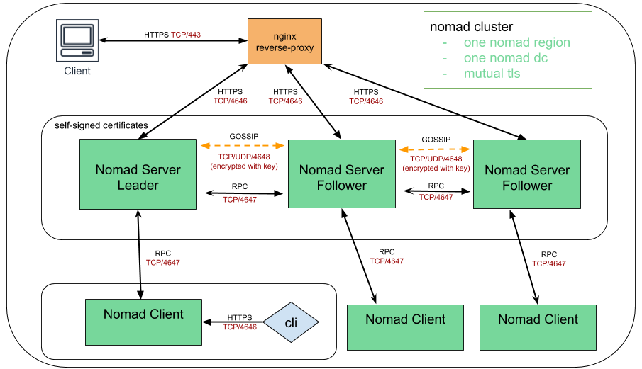

# Run prod Nomad cluster on AWS with terraform in single DC and in single nomad region. A kitchen test is included

## High Level Overview



## Prerequisites

- git
- terraform ( >= 0.12)
- own or control registered domain name for the certificate
- have a DNS record that associates your domain name and your server’s public IP address
- Cloudflare subscription as it is used to manage DNS records automatically
- GCP subscription
- ssh key
- Use pre-built nomad server,client and frontend GCP images on `us-east4` region or bake your own with [Packer](https://www.packer.io)

## How to run

- Get the repo

```
git clone https://github.com/achuchulev/terraform-gcp-nomad-1dc-1region.git
cd terraform-gcp-nomad-1dc-1region
```

- Create `terraform.tfvars` file

| Name  |	Description |	Type |  Default |	Required
| ----- | ----------- | ---- |  ------- | --------
| gcp_credentials_file_path | Locate the GCP credentials .json file. | string  | - | yes
| gcp_project_id | GCP Project ID. | string  | - | yes
| gcp_region | Requester AWS secret key | string  | yes | no
| gcp-vpc-network | VPC network name | string  | no | yes
| gcp-subnet1-name | VPC subnetwork name | string  | no | yes
| cloudflare_email | VPC subnetwork name | string  | no | yes
| cloudflare_token | VPC subnetwork name | string  | no | yes
| cloudflare_zone | VPC subnetwork name | string  | no | yes
| subdomain_name | VPC subnetwork name | string  | no | yes
| servers_count | number of nomad servers | number  | 3 | no
| clients_count | number of nomad  clients | number  | 1 | no
| instance_role | define nomad instance role | string  | server | no
| datacenter | define nomad datacenter name | string  | dc1 | no
| nomad_region | define nomad region | string  | global | no

```
Note: FW should allow inbound traffic on ports:
      
      TCP 443 (https)
      TCP 4646-4648 (Nomad)
      UDP 4648 (Nomad)
```

- Initialize terraform

```
terraform init
```

- Deploy nginx and nomad instances

```
terraform plan
terraform apply
```

- `Terraform apply` will:
  - create new instances on GCP for server/client/frontend
  - copy nomad and nginx configuration files
  - install nomad
  - install cfssl (Cloudflare's PKI and TLS toolkit)
  - generate the selfsigned certificates for Nomad cluster 
  - install nginx
  - configure nginx reverse proxy
  - install certbot
  - automatically enable HTTPS on website with EFF's Certbot, deploying Let's Encrypt certificate
  - check for certificate expiration and automatically renew Let’s Encrypt certificate
  - start nomad server and client
  
## Access Nomad

#### via CLI

for example:

```
$ nomad node status
$ nomad server members
```

```
Note

Nomad CLI defaults to communicating via HTTP instead of HTTPS. As Nomad CLI also searches 
environment variables for default values, the process can be simplified exporting environment 
variables like shown below which is done by the provisioning script:

$ export NOMAD_ADDR=https://your.dns.name
```

#### via WEB UI console

Open web browser, access nomad web console using your instance dns name as URL and verify that 
connection is secured and SSL certificate is valid  

## Run nomad job

#### via UI

- go to `jobs`
- click on `Run job`
- author a job in HCL/JSON format or paste the sample nomad job [nomad_jobs/nginx.hcl](https://github.com/achuchulev/terraform-aws-nomad-1dc-1region/blob/master/nomad_jobs/nginx.hcl) that run nginx on docker
- run `Plan`
- review `Job Plan` and `Run` it

#### via CLI

```
$ nomad job run [options] <job file>
```

## Run kitchen test using kitchen-terraform plugin to verify that expected resources are being deployed   

### on Mac

#### Prerequisites

##### Install rbenv to use ruby version 2.3.1

```
brew install rbenv
rbenv install 2.3.1
rbenv local 2.3.1
rbenv versions
```

##### Add the following lines to your ~/.bash_profile:

```
eval "$(rbenv init -)"
true
export PATH="$HOME/.rbenv/bin:$PATH"
```

##### Reload profile: 

`source ~/.bash_profile`

##### Install bundler

```
gem install bundler
bundle install
```

#### Run the test: 

```
bundle exec kitchen list
bundle exec kitchen converge
bundle exec kitchen verify
bundle exec kitchen destroy
```

### on Linux

#### Prerequisites

```
gem install test-kitchen
gem install kitchen-inspec
gem install kitchen-vagrant
```

#### Run kitchen test 

```
kitchen list
kitchen converge
kitchen verify
kitchen destroy
```

### Sample output

```

```
